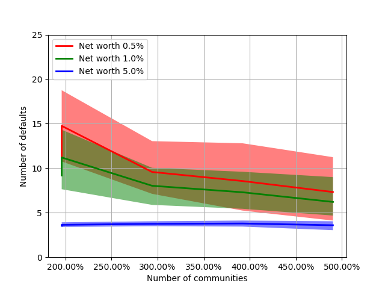

# Modeling and Simulation of Social Systems Fall 2018 – Research Plan

> * Group Name: Karlis & Anas
> * Group participants names: Bachiri Anas, Briedis Karlis Martins
> * Project Title: The Impact of Network Topology on Banking Default Dynamics
> * Programming language: Python 3

## General Introduction

Systemic risk is of crucial importance when dealing with complex systems. In particular,
financial networks are an important illustration of such systems. In this case,
financial institutions interacts with each others respecting the graph structure of the
underlying network.

Recent studies have revealed the relevance of financial network structure in estimating
systemic risk. It has also showed that the neglect of the graph topology is
seriously underestimating the risk of default of the whole network.
In this project, we address the issue of crisis propagation in a banking network. We
construct first a banking system with some parameters, distribute the assets on the
banks and finally we simulate shocks in this financial network.
This work investigate the general behaviour of crisis propagation in a financial network,
and therefore provides some insights about reducing the systemic risk. For
this, we will scan the parameters of the used model and describe the behaviour of
the resilience of financial networks.

## The Model

(Define dependent and independent variables you want to study. Say how you want to measure them.) (Why is your model a good abstraction of the problem you want to study?) (Are you capturing all the relevant aspects of the problem?)

## Fundamental Questions

The main goal of this project is to investigate how does the topology of complex networks impact the default dynamics of the banking network.

More specific questions include:

* How does the network density impact the number of defaults of financial network?
* How does the clustering of network impact the number of defaults of financial network?
* etc.

## References

The project in mainly based on these two papers:

* Nier, Erlend & Yang, Jing & Yorulmazer, Tanju & Alentorn, Amadeo. (2008). Network Models and Financial Stability. Journal of Economic Dynamics and Control. 31. 2033-2060. 10.1016/j.jedc.2007.01.014.
* V. Kashirin, Victor. (2014). Evolutionary Simulation of Complex Networks Structures with Specific Topological Properties. Procedia Computer Science. 29. 2401-2411. 10.1016/j.procs.2014.05.224.

## Research Methods

Random graph generation of simulated annealing.
Crisis propagation in random graph.

# Reproducibility

> Prerequisite for all reproducibility tests is `python >=3.6`

### Installing dependencies

```
python -m pip install numpy matplotlib python-igraph
```

> For installation of igraph, please refer to its [python-igraph Manual](https://igraph.org/python/doc/tutorial/install.html).
> **_For Windows users_** a convinient way is to use [unofficial windows binaries](https://www.lfd.uci.edu/~gohlke/pythonlibs/#python-igraph) by downloading suitable `.whl` file and running e.g. `pip install python_igraph‑0.7.1.post6‑cp36‑cp36m‑win_amd64.whl`

### Cloning the project

```
git clone https://github.com/kmbriedis/msss_project.git
cd msss_project/code
```

## Light test

To run light tests, make sure all dependencies are installed and you are in cloned directory.

### Reproducing default dynamics

To reproduce results of Nier et al. and observe how default dynamics of banking network are affected by variation of net worth, interbank assets, or Erdös-Rényi probability, run (running time 1-2 minutes):

```
python test_light.py --reproduce-sim
```

You should see graphs like these, which show how the default dynamics (number of defaulted banks) are affected by variantion of different attributes

|                                       | Light test                                                   | Full test                                                  | Nier et al.                                                       |
| ------------------------------------- | ------------------------------------------------------------ | ---------------------------------------------------------- | ----------------------------------------------------------------- |
| Percentage net worth variation        |         |         |         |
| Percentage interbank assets variation |  |  |  |
| Erdös-Rényi probability variation     |         |         |         |

### Reproducing default dynamics on graphs with specific topological properties

There are pregenerated graphs in `other/pregenerated_graphs` directory. Unzip `clustering_light.zip` and `communities.zip` in your chosen **`$UNZIP_DIR`**

Run (by replacing `$UNZIP_DIR` with extraction directory):

```
python test_light.py --sim-communities $UNZIP_DIR/communities
python test_light.py --sim-clustering $UNZIP_DIR/clustering_light
```

You should see graphs like these, which show how the default dynamics (number of defaulted banks) are affected by different clustering coefficients and number of communities

|                                  | Light test                                              | Full test                                       |
| -------------------------------- | ------------------------------------------------------- | ----------------------------------------------- |
| Clustering coefficient variation |        |  |
| Number of communities variation  |  | Same as light                                   |

## Full test

Make sure all dependencies are installed and you are in the cloned directory.

### Reproducing default dynamics

Refer to **Light test**, but simulations must be run with command `python test_light.py --reproduce-sim`, where sample points and samplea are increased (10x increase in number of graphs and running time).

### Reproducing default dynamics on graphs with specific topological properties

Refer to **Light test**, but running the command with pregenerated graphs from `other/pregenerated_graphs/clustering.zip`

### Pregeneration of graphs with specific properties

To pregenerate graphs for further simulation, run these commands

> **Warning** Generation is compute-intensive and can take up to 6 hours when running on [ETH's Euler cluster](https://scicomp.ethz.ch/wiki/Euler)'s 48 cores (12 days of CPU time) when using --clustering flag.

```
python generate_multicore.py --communities
python generate_multicore.py --clustering-light
python generate_multicore.py --clustering
```

#### Running on ETH Euler cluster

To run the generation on ETH Zurich Euler cluster, use SSH to access the cluster, connectiong to <nethz_username>@euler.ethz.ch and run following commands:

```
mkdir -p $HOME/python/lib64/python3.6/site-packages
export PYTHONPATH=$HOME/python/lib64/python3.6/site-packages:$PYTHONPATH
module load python/3.6.0

python -m pip install --install-option="--prefix=$HOME/python" python-igraph numpy

git clone https://github.com/kmbriedis/msss_project.git
cd msss_project/code

bsub -W 24:00 -n 48 python generate_multicore.py --clustering # or any other command
```
