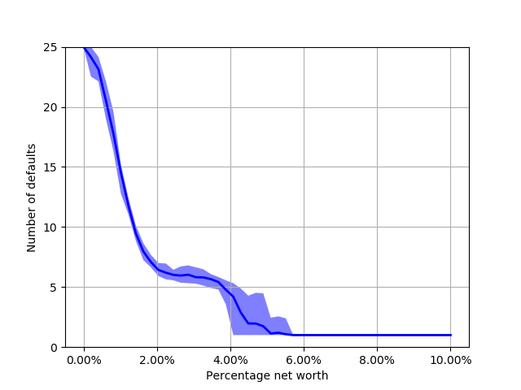

# Modeling and Simulation of Social Systems Fall 2018 – Research Plan

> * Group Name: Karlis & Anas
> * Group participants names: Bachiri Anas, Briedis Karlis Martins
> * Project Title: The Impact of Network Topology on Banking Default Dynamics
> * Programming language: Python 3

## General Introduction

(States your motivation clearly: why is it important / interesting to solve this problem?)
(Add real-world examples, if any)
(Put the problem into a historical context, from what does it originate? Are there already some proposed solutions?)

## The Model

(Define dependent and independent variables you want to study. Say how you want to measure them.) (Why is your model a good abstraction of the problem you want to study?) (Are you capturing all the relevant aspects of the problem?)

## Fundamental Questions

(At the end of the project you want to find the answer to these questions)
(Formulate a few, clear questions. Articulate them in sub-questions, from the more general to the more specific. )

## Expected Results

(What are the answers to the above questions that you expect to find before starting your research?)

## References

Nier, Erlend & Yang, Jing & Yorulmazer, Tanju & Alentorn, Amadeo. (2008). Network Models and Financial Stability. Journal of Economic Dynamics and Control. 31. 2033-2060. 10.1016/j.jedc.2007.01.014.

(Add the bibliographic references you intend to use)
(Explain possible extension to the above models)
(Code / Projects Reports of the previous year)

## Research Methods

(Cellular Automata, Agent-Based Model, Continuous Modeling...) (If you are not sure here: 1. Consult your colleagues, 2. ask the teachers, 3. remember that you can change it afterwards)

## Other

(mention datasets you are going to use)

# Reproducibility

> Prerequisite for all reproducibility tests is `python >=3.6`

### Installing dependencies

```
python -m pip install numpy matplotlib python-igraph
```

> For installation of igraph, please refer to its [python-igraph Manual](https://igraph.org/python/doc/tutorial/install.html).
> **_For Windows users_** a convinient way is to use [unofficial windows binaries](https://www.lfd.uci.edu/~gohlke/pythonlibs/#python-igraph) by downloading suitable `.whl` file and running e.g. `pip install python_igraph‑0.7.1.post6‑cp36‑cp36m‑win_amd64.whl`

### Cloning the project

```
git clone git@github.com:kmbriedis/msss_project.git
cd msss_project/code
```

## Light test

To run light tests, make sure all dependencies are installed and you are in cloned directory.

### Reproducing default dynamics

To reproduce results of Nier et al., (...) run (running time 1-2 minutes):

```
python test_light.py --reproduce-sim
```

You should see graphs like these, which show how the default dynamics (number of defaulted banks) are affected by variantion of different attributes

|                                       | Light test                                                   | Full test                                                  | Nier et al.                                                       |
| ------------------------------------- | ------------------------------------------------------------ | ---------------------------------------------------------- | ----------------------------------------------------------------- |
| Percentage net worth variation        |         |         |         |
| Percentage interbank assets variation |  |  |  |
| Erdös-Rényi probability variation     |         |         |         |

### Reproducing default dynamics on graphs with specific topological properties

There are pregenerated graphs in `other/pregenerated_graphs` directory. Unzip `clustering_light.zip` and `communities.zip` in your chosen **`$UNZIP_DIR`**

Run (by replacing `$UNZIP_DIR` with extraction directory):

```
python test_light.py --sim-communities $UNZIP_DIR/communities
python test_light.py --sim-clustering $UNZIP_DIR/clustering_light
```

You should see graphs like these, which show how the default dynamics (number of defaulted banks) are affected by different clustering coefficients and number of communities

|                                  | Light test                                              | Full test                                       |
| -------------------------------- | ------------------------------------------------------- | ----------------------------------------------- |
| Clustering coefficient variation |        |  |
| Number of communities variation  |  | Same as light                                   |

### BONUS: Reproducing complex network structure generation

TODO

## Full test

Make sure all dependencies are installed and you are in cloned directory.

### Reproducing default dynamics

Refer to **Light test**, but simulations must be run with command `python test_light.py --reproduce-sim`, where sample points and samplea are increased (10x increase in number of graphs and running time).

### Reproducing default dynamics on graphs with specific topological properties

Refer to **Light test**, but running the command with pregenerated graphs from `other/pregenerated_graphs/clustering.zip`

### Pregeneration of graphs with specific properties

To pregenerate graph for further simulation, run these commands

> **Warning** Generation is compute-intensive and can take up to 6 hours when running on [ETH's Euler cluster](https://scicomp.ethz.ch/wiki/Euler)'s 48 cores (12 days of CPU time) when using --clustering flag.

```
python generate_multicore.py --communities
python generate_multicore.py --clustering-light
python generate_multicore.py --clustering
```

#### Running on ETH Euler cluster

To run the generation on ETH Zurich Euler cluster, use SSH to access the cluster, connectiong to <nethz_username>@euler.ethz.ch and run following commands:

```
mkdir -p $HOME/python/lib64/python3.6/site-packages
export PYTHONPATH=$HOME/python/lib64/python3.6/site-packages:$PYTHONPATH
module load python/3.6.0

python -m pip install --install-option="--prefix=$HOME/python" python-igraph numpy

git clone git@github.com:kmbriedis/msss_project.git
cd msss_project/code

bsub -W 24:00 -n 48 python generate_multicore.py --clustering # or any other command
```
